<h1 align="center">Hi 👋, I'm Nikhila</h1>

  <b>Backend Developer • Full Stack Developer • AI Enthusiast</b>

Building scalable backend systems, modern web applications, and AI-powered solutions.

  
  &nbsp;
  

---

## Featured Projects:

- 🌱 **[EcoVision AI](https://github.com/nikhilach7/Ecovision)** — AI-powered smart waste segregation and monitoring platform with groq api chatbot.
- 🎫 **[Support Nest](https://github.com/nikhilach7/support-nest)** — AI-powered support ticket management system that automatically classifies ticket using gemini api.
- 🕵️ **[SnapSure](https://github.com/nikhilach7/SnapSure)** — Deepfake detection platform with containerized deployment.
- ⚡ **[PulseSync](https://github.com/nikhilach7/Pulsesync)** — Incident management platform with an event-driven backend with redis and rabbitmq.

---

## GitHub Statistics:

  
  

  

---

## Tech Stack:

### Languages

### Frameworks & Databases:

###  AI, Cloud & DevOps:

---

  <i>Always learning. Always building.</i>

